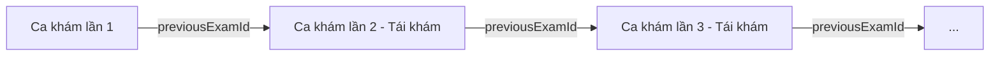
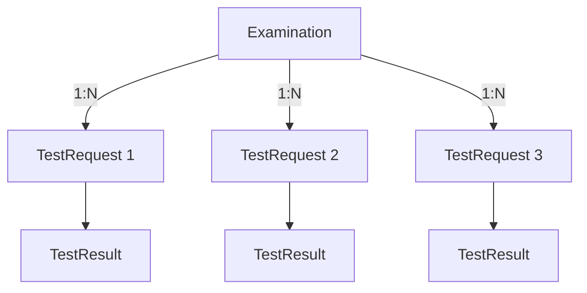
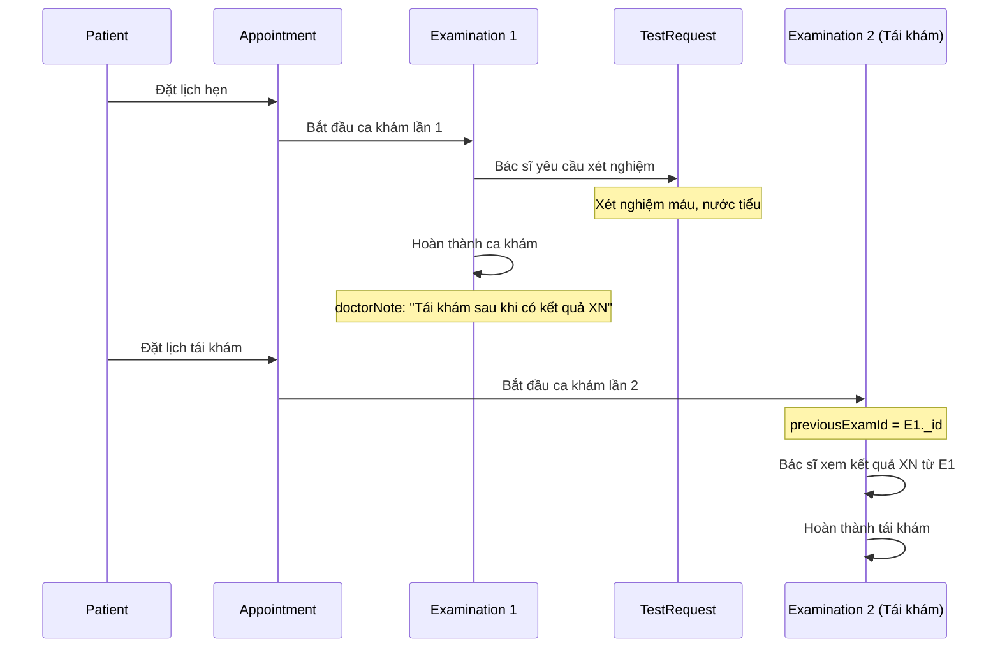

# Cấu Trúc Dữ Liệu: Tái Khám & Yêu Cầu Xét Nghiệm

## Tổng Quan

Hệ thống đã được thiết kế sẵn để hỗ trợ **tái khám** và **yêu cầu xét nghiệm** thông qua các mối quan hệ giữa các model.

---

## 1. Cấu Trúc Tái Khám (Follow-up Examination)

### Cách Lưu Trữ

Dữ liệu tái khám được lưu thông qua **chuỗi liên kết** giữa các `Examination` records sử dụng trường `previousExamId`.

### Schema Examination

```javascript
{
  _id: ObjectId,
  appointmentId: ObjectId,        // Lịch hẹn tương ứng
  doctorId: ObjectId,              // Bác sĩ khám
  staffId: ObjectId,               // Nhân viên tạo ca khám
  serviceId: ObjectId,             // Dịch vụ khám
  patientId: ObjectId,             // Bệnh nhân
  previousExamId: ObjectId,        // 🔗 Liên kết đến ca khám trước (nếu là tái khám)
  examDate: Date,
  diagnosis: String,
  treatment: String,
  doctorNote: String,
  resultSummary: String,
  status: 'processing' | 'done'
}
```

### Quy Trình Tái Khám



### Ví Dụ Cụ Thể

#### Ca khám lần 1 (Khám đầu tiên)
```json
{
  "_id": "exam001",
  "appointmentId": "appt001",
  "patientId": "patient001",
  "doctorId": "doctor001",
  "previousExamId": null,           // ← Không có ca khám trước
  "diagnosis": "Đau đầu do stress",
  "treatment": "Nghỉ ngơi, uống thuốc",
  "doctorNote": "Tái khám sau 1 tuần",
  "status": "done"
}
```

#### Ca khám lần 2 (Tái khám)
```json
{
  "_id": "exam002",
  "appointmentId": "appt002",
  "patientId": "patient001",
  "doctorId": "doctor001",
  "previousExamId": "exam001",      // ← Liên kết đến ca khám trước
  "diagnosis": "Đau đầu đã giảm",
  "treatment": "Tiếp tục nghỉ ngơi",
  "doctorNote": "Bệnh nhân đã khỏi",
  "status": "done"
}
```

### Lợi Ích Của Cấu Trúc Này

✅ **Truy vết lịch sử khám**: Dễ dàng xem toàn bộ chuỗi ca khám của bệnh nhân  
✅ **So sánh tiến triển**: Bác sĩ có thể so sánh kết quả giữa các lần khám  
✅ **Linh hoạt**: Không giới hạn số lần tái khám  
✅ **Đơn giản**: Chỉ cần 1 trường `previousExamId`

---

## 2. Cấu Trúc Yêu Cầu Xét Nghiệm (Test Request)

### Cách Lưu Trữ

Yêu cầu xét nghiệm được lưu trong collection `TestRequest`, liên kết với `Examination` thông qua `examId`.

### Schema TestRequest

```javascript
{
  _id: ObjectId,
  examId: ObjectId,                // 🔗 Liên kết đến ca khám
  serviceId: ObjectId,             // Dịch vụ xét nghiệm (từ Service collection)
  testType: String,                // Loại xét nghiệm (máu, nước tiểu, X-quang...)
  requestedAt: Date,               // Thời gian yêu cầu
  status: 'waiting' | 'processing' | 'completed',
  labNurseId: ObjectId             // Y tá xét nghiệm phụ trách
}
```

### Mối Quan Hệ



**Một ca khám có thể có nhiều yêu cầu xét nghiệm**

### Ví Dụ Cụ Thể

#### Examination
```json
{
  "_id": "exam001",
  "patientId": "patient001",
  "doctorId": "doctor001",
  "diagnosis": "Nghi ngờ thiếu máu",
  "status": "processing"
}
```

#### TestRequest 1 - Xét nghiệm máu
```json
{
  "_id": "test001",
  "examId": "exam001",              // ← Liên kết đến ca khám
  "serviceId": "service_xn_mau",
  "testType": "Xét nghiệm máu",
  "requestedAt": "2025-12-03T08:00:00Z",
  "status": "waiting",
  "labNurseId": "nurse001"
}
```

#### TestRequest 2 - Xét nghiệm nước tiểu
```json
{
  "_id": "test002",
  "examId": "exam001",              // ← Cùng ca khám
  "serviceId": "service_xn_tieu",
  "testType": "Xét nghiệm nước tiểu",
  "requestedAt": "2025-12-03T08:05:00Z",
  "status": "waiting",
  "labNurseId": "nurse001"
}
```

---

## 3. Quy Trình Hoàn Chỉnh

### Kịch Bản: Bệnh nhân khám và cần tái khám + xét nghiệm



### Dữ Liệu Tương Ứng

#### 1. Appointment lần 1
```json
{
  "_id": "appt001",
  "patientId": "patient001",
  "doctorId": "doctor001",
  "status": "confirmed"
}
```

#### 2. Examination lần 1
```json
{
  "_id": "exam001",
  "appointmentId": "appt001",
  "patientId": "patient001",
  "doctorId": "doctor001",
  "previousExamId": null,
  "diagnosis": "Nghi ngờ thiếu máu",
  "doctorNote": "Cần xét nghiệm máu và tái khám sau 3 ngày",
  "status": "done"
}
```

#### 3. TestRequest từ Examination lần 1
```json
[
  {
    "_id": "test001",
    "examId": "exam001",
    "testType": "Xét nghiệm máu",
    "status": "completed"
  },
  {
    "_id": "test002",
    "examId": "exam001",
    "testType": "Xét nghiệm nước tiểu",
    "status": "completed"
  }
]
```

#### 4. Appointment lần 2 (Tái khám)
```json
{
  "_id": "appt002",
  "patientId": "patient001",
  "doctorId": "doctor001",
  "status": "confirmed"
}
```

#### 5. Examination lần 2 (Tái khám)
```json
{
  "_id": "exam002",
  "appointmentId": "appt002",
  "patientId": "patient001",
  "doctorId": "doctor001",
  "previousExamId": "exam001",        // ← Liên kết đến ca khám trước
  "diagnosis": "Thiếu máu nhẹ, đã cải thiện",
  "treatment": "Bổ sung sắt, ăn uống đầy đủ",
  "doctorNote": "Không cần tái khám",
  "status": "done"
}
```

---

## 4. Truy Vấn Dữ Liệu

### Lấy lịch sử khám của bệnh nhân

```javascript
// Lấy tất cả ca khám của bệnh nhân, sắp xếp theo thời gian
const examinations = await Examination.find({ patientId })
  .sort({ examDate: -1 })
  .populate('previousExamId')
  .populate('doctorId', 'fullName specialty');
```

### Lấy chuỗi tái khám

```javascript
// Bắt đầu từ ca khám hiện tại, đi ngược về quá khứ
async function getExaminationChain(currentExamId) {
  const chain = [];
  let exam = await Examination.findById(currentExamId).populate('previousExamId');
  
  while (exam) {
    chain.push(exam);
    exam = exam.previousExamId;
  }
  
  return chain; // [exam hiện tại, exam trước đó, exam trước nữa, ...]
}
```

### Lấy tất cả yêu cầu xét nghiệm của ca khám

```javascript
const testRequests = await TestRequest.find({ examId })
  .populate('serviceId', 'name price')
  .populate('labNurseId', 'fullName');
```

### Lấy ca khám kèm xét nghiệm

```javascript
const examination = await Examination.findById(examId)
  .populate('patientId')
  .populate('doctorId')
  .populate('previousExamId');

const testRequests = await TestRequest.find({ examId })
  .populate('serviceId');

return {
  examination,
  testRequests
};
```

---

## 5. API Cần Bổ Sung

Để hỗ trợ đầy đủ tái khám và xét nghiệm, cần thêm các API sau:

### API Tái Khám

```javascript
// 1. Tạo lịch tái khám từ ca khám hiện tại
POST /api/examinations/:examId/follow-up
Body: {
  appointmentDate: "2025-12-10T08:00:00Z",
  note: "Tái khám kiểm tra kết quả"
}

// 2. Lấy lịch sử khám của bệnh nhân
GET /api/patients/:patientId/examination-history

// 3. Lấy chuỗi tái khám
GET /api/examinations/:examId/chain
```

### API Yêu Cầu Xét Nghiệm

```javascript
// 1. Tạo yêu cầu xét nghiệm
POST /api/examinations/:examId/test-requests
Body: {
  serviceId: "service_xn_mau",
  testType: "Xét nghiệm máu",
  labNurseId: "nurse001"
}

// 2. Lấy danh sách yêu cầu xét nghiệm của ca khám
GET /api/examinations/:examId/test-requests

// 3. Cập nhật trạng thái xét nghiệm
PUT /api/test-requests/:id/status
Body: { status: "completed" }
```

---

## 6. Tóm Tắt

### Tái Khám
- ✅ Lưu trong collection `Examination`
- ✅ Sử dụng `previousExamId` để liên kết
- ✅ Tạo chuỗi lịch sử khám không giới hạn
- ✅ Mỗi lần tái khám = 1 Appointment mới + 1 Examination mới

### Yêu Cầu Xét Nghiệm
- ✅ Lưu trong collection `TestRequest`
- ✅ Liên kết với `Examination` qua `examId`
- ✅ Một ca khám có thể có nhiều yêu cầu xét nghiệm
- ✅ Theo dõi trạng thái: waiting → processing → completed

### Ưu Điểm Thiết Kế
- 🎯 **Rõ ràng**: Mỗi entity có trách nhiệm riêng
- 🔗 **Liên kết chặt chẽ**: Dễ dàng truy vết quan hệ
- 📊 **Báo cáo tốt**: Dễ tạo báo cáo lịch sử khám, thống kê xét nghiệm
- 🔄 **Mở rộng**: Dễ thêm tính năng mới (TestResult, Prescription...)
