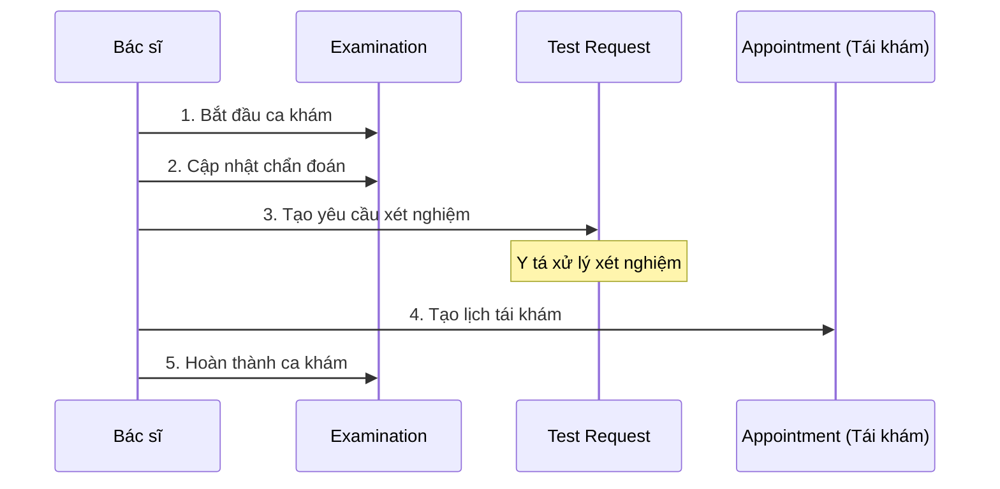

# API: Yêu Cầu Xét Nghiệm & Tái Khám

## Tổng Quan

Tài liệu này mô tả các API cho phép bác sĩ gửi yêu cầu xét nghiệm và tạo lịch hẹn tái khám trong quá trình khám bệnh.

---

## 🧪 YÊU CẦU XÉT NGHIỆM (Test Requests)

### 1. Tạo Yêu Cầu Xét Nghiệm

Bác sĩ tạo yêu cầu xét nghiệm cho bệnh nhân trong quá trình khám.

**Endpoint:** `POST /api/test-requests`

**Headers:**
```
Authorization: Bearer <token>
Content-Type: application/json
```

**Request Body:**
```json
{
  "examId": "string (required) - ID ca khám",
  "serviceId": "string (required) - ID dịch vụ xét nghiệm",
  "testType": "string (required) - Loại xét nghiệm (Xét nghiệm máu, nước tiểu, X-quang...)",
  "labNurseId": "string (required) - ID y tá xét nghiệm phụ trách"
}
```

**Response Success (201):**
```json
{
  "status": true,
  "message": "Tạo yêu cầu xét nghiệm thành công",
  "data": {
    "_id": "64abc...",
    "examId": {
      "_id": "64abc...",
      "patientId": "64abc...",
      "doctorId": "64abc...",
      "examDate": "2025-12-03T08:00:00.000Z"
    },
    "serviceId": {
      "_id": "64abc...",
      "name": "Xét nghiệm máu tổng quát",
      "price": 150000,
      "description": "Xét nghiệm công thức máu"
    },
    "testType": "Xét nghiệm máu",
    "labNurseId": {
      "_id": "64abc...",
      "fullName": "Y tá Nguyễn Thị D"
    },
    "requestedAt": "2025-12-03T08:25:00.000Z",
    "status": "waiting",
    "createdAt": "2025-12-03T08:25:00.000Z",
    "updatedAt": "2025-12-03T08:25:00.000Z"
  }
}
```

**Response Error (400):**
```json
{
  "status": false,
  "message": "Không thể tạo yêu cầu xét nghiệm cho ca khám đã hoàn thành"
}
```

---

### 2. Lấy Danh Sách Yêu Cầu Xét Nghiệm Theo Ca Khám

**Endpoint:** `GET /api/examinations/:examId/test-requests`

**Headers:**
```
Authorization: Bearer <token>
```

**URL Parameters:**
- `examId`: ID của ca khám

**Response Success (200):**
```json
{
  "status": true,
  "data": [
    {
      "_id": "64abc...",
      "serviceId": {
        "_id": "64abc...",
        "name": "Xét nghiệm máu",
        "price": 150000,
        "description": "...",
        "serviceType": "test"
      },
      "testType": "Xét nghiệm máu",
      "labNurseId": {
        "_id": "64abc...",
        "fullName": "Y tá Nguyễn Thị D"
      },
      "requestedAt": "2025-12-03T08:25:00.000Z",
      "status": "waiting"
    },
    {
      "_id": "64def...",
      "serviceId": {
        "_id": "64def...",
        "name": "Xét nghiệm nước tiểu",
        "price": 100000
      },
      "testType": "Xét nghiệm nước tiểu",
      "status": "completed"
    }
  ]
}
```

---

### 3. Lấy Thông Tin Chi Tiết Yêu Cầu Xét Nghiệm

**Endpoint:** `GET /api/test-requests/:id`

**Headers:**
```
Authorization: Bearer <token>
```

**URL Parameters:**
- `id`: ID của yêu cầu xét nghiệm

**Response Success (200):**
```json
{
  "status": true,
  "data": {
    "_id": "64abc...",
    "examId": {
      "_id": "64abc...",
      "patientId": "...",
      "doctorId": "...",
      "examDate": "..."
    },
    "serviceId": {
      "_id": "64abc...",
      "name": "Xét nghiệm máu tổng quát",
      "price": 150000,
      "description": "...",
      "serviceType": "test"
    },
    "testType": "Xét nghiệm máu",
    "labNurseId": {
      "_id": "64abc...",
      "fullName": "Y tá Nguyễn Thị D"
    },
    "requestedAt": "2025-12-03T08:25:00.000Z",
    "status": "processing"
  }
}
```

---

### 4. Cập Nhật Trạng Thái Yêu Cầu Xét Nghiệm

Y tá xét nghiệm cập nhật trạng thái khi bắt đầu xử lý hoặc hoàn thành.

**Endpoint:** `PUT /api/test-requests/:id/status`

**Headers:**
```
Authorization: Bearer <token>
Content-Type: application/json
```

**URL Parameters:**
- `id`: ID của yêu cầu xét nghiệm

**Request Body:**
```json
{
  "status": "waiting|processing|completed (required)"
}
```

**Response Success (200):**
```json
{
  "status": true,
  "message": "Cập nhật trạng thái thành completed thành công",
  "data": {
    "_id": "64abc...",
    "status": "completed",
    ...
  }
}
```

---

### 5. Danh Sách Yêu Cầu Xét Nghiệm

Lấy danh sách tất cả yêu cầu xét nghiệm với filter.

**Endpoint:** `GET /api/test-requests`

**Headers:**
```
Authorization: Bearer <token>
```

**Query Parameters (tất cả optional):**
- `status`: Lọc theo trạng thái (`waiting`, `processing`, `completed`)
- `labNurseId`: Lọc theo ID y tá xét nghiệm
- `examId`: Lọc theo ID ca khám
- `fromDate`: Lọc từ ngày (ISO format: `2025-12-01`)
- `toDate`: Lọc đến ngày (ISO format: `2025-12-31`)
- `limit`: Số lượng kết quả (mặc định: 50)
- `skip`: Bỏ qua số lượng kết quả (mặc định: 0)

**Example Request:**
```
GET /api/test-requests?status=waiting&labNurseId=64abc...&limit=20
```

**Response Success (200):**
```json
{
  "status": true,
  "data": {
    "testRequests": [
      {
        "_id": "64abc...",
        "examId": {
          "_id": "64abc...",
          "patientId": "...",
          "doctorId": "...",
          "examDate": "..."
        },
        "serviceId": {
          "_id": "64abc...",
          "name": "Xét nghiệm máu",
          "price": 150000
        },
        "testType": "Xét nghiệm máu",
        "labNurseId": {
          "_id": "64abc...",
          "fullName": "Y tá Nguyễn Thị D"
        },
        "requestedAt": "2025-12-03T08:25:00.000Z",
        "status": "waiting"
      }
    ],
    "total": 15,
    "limit": 20,
    "skip": 0
  }
}
```

---

## 🔄 TÁI KHÁM (Follow-up Appointments)

### 6. Tạo Lịch Hẹn Tái Khám

Bác sĩ tạo lịch hẹn tái khám cho bệnh nhân từ ca khám hiện tại.

**Endpoint:** `POST /api/examinations/:id/follow-up`

**Headers:**
```
Authorization: Bearer <token>
Content-Type: application/json
```

**URL Parameters:**
- `id`: ID của ca khám hiện tại

**Request Body:**
```json
{
  "appointmentDate": "ISO 8601 datetime (required) - Ngày giờ tái khám",
  "note": "string (optional) - Ghi chú cho lịch tái khám"
}
```

**Response Success (201):**
```json
{
  "status": true,
  "message": "Tạo lịch hẹn tái khám thành công",
  "data": {
    "appointment": {
      "_id": "64abc...",
      "patientId": "64abc...",
      "doctorId": "64abc...",
      "appointmentDate": "2025-12-10T08:00:00.000Z",
      "status": "confirmed",
      "note": "Tái khám từ ca khám ngày 03/12/2025",
      "createdAt": "2025-12-03T08:30:00.000Z"
    },
    "currentExamination": {
      "_id": "64abc...",
      "patientId": {
        "_id": "64abc...",
        "fullName": "Nguyễn Văn A"
      },
      "doctorId": {
        "_id": "64abc...",
        "fullName": "BS. Trần Thị B"
      },
      "examDate": "2025-12-03T08:00:00.000Z",
      "diagnosis": "...",
      "doctorNote": "...\n[Đã tạo lịch tái khám: 10/12/2025, 08:00:00]"
    }
  }
}
```

**Response Error (400):**
```json
{
  "status": false,
  "message": "appointmentDate là bắt buộc"
}
```

**Response Error (404):**
```json
{
  "status": false,
  "message": "Không tìm thấy ca khám"
}
```

---

## 📋 Quy Trình Sử Dụng

### Quy Trình Khám Bệnh Hoàn Chỉnh



### Ví Dụ Cụ Thể

#### 1. Bác sĩ bắt đầu khám
```bash
POST /api/examinations/start
{
  "appointmentId": "64abc...",
  "staffId": "64def...",
  "serviceId": "64ghi..."
}
```

#### 2. Bác sĩ yêu cầu xét nghiệm máu
```bash
POST /api/test-requests
{
  "examId": "64jkl...",
  "serviceId": "64mno...",
  "testType": "Xét nghiệm máu tổng quát",
  "labNurseId": "64pqr..."
}
```

#### 3. Bác sĩ yêu cầu xét nghiệm nước tiểu
```bash
POST /api/test-requests
{
  "examId": "64jkl...",
  "serviceId": "64stu...",
  "testType": "Xét nghiệm nước tiểu",
  "labNurseId": "64pqr..."
}
```

#### 4. Bác sĩ tạo lịch tái khám sau 1 tuần
```bash
POST /api/examinations/64jkl.../follow-up
{
  "appointmentDate": "2025-12-10T08:00:00Z",
  "note": "Tái khám kiểm tra kết quả xét nghiệm"
}
```

#### 5. Bác sĩ hoàn thành ca khám
```bash
PUT /api/examinations/64jkl.../complete
{
  "diagnosis": "Thiếu máu nhẹ",
  "treatment": "Bổ sung sắt, ăn uống đầy đủ",
  "doctorNote": "Đã yêu cầu xét nghiệm máu và nước tiểu. Tái khám sau 1 tuần.",
  "resultSummary": "Cần theo dõi kết quả xét nghiệm"
}
```

---

## 🔗 Mối Quan Hệ Dữ Liệu

### Examination → Test Requests (1:N)
Một ca khám có thể có nhiều yêu cầu xét nghiệm.

```javascript
// Lấy ca khám kèm tất cả yêu cầu xét nghiệm
const examination = await Examination.findById(examId);
const testRequests = await TestRequest.find({ examId });
```

### Examination → Follow-up Appointment (1:1)
Một ca khám có thể tạo một lịch hẹn tái khám.

```javascript
// Lịch tái khám sẽ có note chứa thông tin ca khám trước
{
  note: "Tái khám từ ca khám ngày 03/12/2025"
}
```

### Examination Chain (previousExamId)
Khi bệnh nhân đến tái khám, ca khám mới sẽ liên kết với ca khám trước.

```javascript
// Ca khám tái khám
{
  _id: "exam002",
  previousExamId: "exam001", // Liên kết đến ca khám trước
  ...
}
```

---

## ⚠️ Lưu Ý Quan Trọng

### Yêu Cầu Xét Nghiệm
1. **Service Type**: Service phải có `serviceType = 'test'`
2. **Examination Status**: Chỉ tạo được cho ca khám đang `processing`
3. **Lab Nurse**: Phải chỉ định y tá xét nghiệm khi tạo yêu cầu
4. **Trạng thái**: `waiting` → `processing` → `completed`

### Lịch Hẹn Tái Khám
1. **Auto-confirmed**: Lịch tái khám tự động có status `confirmed`
2. **Same Doctor**: Giữ nguyên bác sĩ từ ca khám hiện tại
3. **Same Staff**: Giữ nguyên nhân viên đã tạo ca khám
4. **Doctor Note**: Tự động cập nhật ghi chú bác sĩ trong ca khám hiện tại

---

## 📊 Tổng Kết API Mới

| Chức Năng | Endpoint | Method |
|-----------|----------|--------|
| Tạo yêu cầu xét nghiệm | `/api/test-requests` | POST |
| Xem yêu cầu XN theo ca khám | `/api/examinations/:examId/test-requests` | GET |
| Xem chi tiết yêu cầu XN | `/api/test-requests/:id` | GET |
| Cập nhật trạng thái XN | `/api/test-requests/:id/status` | PUT |
| Danh sách yêu cầu XN | `/api/test-requests` | GET |
| Tạo lịch tái khám | `/api/examinations/:id/follow-up` | POST |

**Tổng cộng: 6 APIs mới**

---

## 🎯 Use Cases

### Use Case 1: Bác sĩ yêu cầu nhiều xét nghiệm
```javascript
// Tạo nhiều yêu cầu xét nghiệm cho cùng một ca khám
const testTypes = [
  { serviceId: "service1", testType: "Xét nghiệm máu" },
  { serviceId: "service2", testType: "Xét nghiệm nước tiểu" },
  { serviceId: "service3", testType: "X-quang phổi" }
];

for (const test of testTypes) {
  await createTestRequest({
    examId,
    ...test,
    labNurseId
  });
}
```

### Use Case 2: Tái khám định kỳ
```javascript
// Tạo lịch tái khám sau 1 tuần
const followUpDate = new Date();
followUpDate.setDate(followUpDate.getDate() + 7);

await createFollowUpAppointment(examId, {
  appointmentDate: followUpDate,
  note: "Tái khám kiểm tra kết quả điều trị"
});
```

### Use Case 3: Theo dõi tiến trình xét nghiệm
```javascript
// Lấy tất cả yêu cầu xét nghiệm đang chờ
const pendingTests = await listTestRequests({
  status: 'waiting',
  labNurseId: currentNurse._id
});
```
