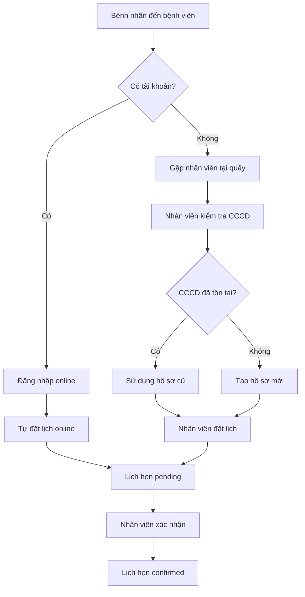

# 🏥 HƯỚNG DẪN XỬ LÝ BỆNH NHÂN WALK-IN

## 📋 Tổng quan

Hệ thống hỗ trợ **2 loại bệnh nhân**:

| Loại | Có tài khoản User? | Cách tạo | Đặt lịch |
|------|-------------------|----------|----------|
| **Online Patient** | ✅ Có | Tự đăng ký qua `/auth/register` | Tự đặt lịch online |
| **Walk-in Patient** | ❌ Không | Nhân viên tạo tại quầy | Nhân viên đặt lịch |

---

## 🎯 Quy trình xử lý Walk-in Patient

### Bước 1: Nhân viên đăng nhập
```bash
POST /auth/login
Content-Type: application/json

{
  "username": "staff123",
  "password": "password123"
}
```

**Response:**
```json
{
  "status": true,
  "token": "eyJhbGciOiJIUzI1NiIsInR5cCI6IkpXVCJ9...",
  "user": {
    "_id": "...",
    "username": "staff123",
    "role": "staff"
  }
}
```

Lưu token để sử dụng cho các request tiếp theo.

---

### Bước 2: Tạo hồ sơ bệnh nhân walk-in

**Endpoint:**
```
POST /patients
```

**Headers:**
```
Authorization: Bearer <staff_token>
Content-Type: application/json
```

**Request Body:**
```json
{
  "fullName": "Nguyễn Văn A",
  "gender": "male",
  "dateOfBirth": "1990-01-15",
  "address": "123 Đường ABC, Quận 1, TP.HCM",
  "phone": "0901234567",
  "cccd": "001234567890"
}
```

**Required Fields:**
- ✅ `fullName` - Họ tên đầy đủ
- ✅ `gender` - Giới tính (`male`, `female`, `other`)
- ✅ `dateOfBirth` - Ngày sinh (format: YYYY-MM-DD)
- ✅ `phone` - Số điện thoại
- ✅ `cccd` - Số CMND/CCCD (unique)

**Optional Fields:**
- `address` - Địa chỉ

**Response Success:**
```json
{
  "status": true,
  "message": "Tạo hồ sơ bệnh nhân thành công",
  "data": {
    "_id": "507f1f77bcf86cd799439012",
    "userId": null,
    "fullName": "Nguyễn Văn A",
    "gender": "male",
    "dateOfBirth": "1990-01-15T00:00:00.000Z",
    "address": "123 Đường ABC, Quận 1, TP.HCM",
    "phone": "0901234567",
    "cccd": "001234567890",
    "registerDate": "2024-01-01T00:00:00.000Z",
    "createdAt": "2024-01-01T00:00:00.000Z",
    "updatedAt": "2024-01-01T00:00:00.000Z"
  }
}
```

**Lưu ý:** `userId` = `null` nghĩa là bệnh nhân này **không có tài khoản User**.

---

### Bước 3: Đặt lịch khám cho bệnh nhân walk-in

**Endpoint:**
```
POST /appointments
```

**Headers:**
```
Authorization: Bearer <staff_token>
Content-Type: application/json
```

**Request Body:**
```json
{
  "patientId": "507f1f77bcf86cd799439012",
  "doctorId": "507f1f77bcf86cd799439013",
  "appointmentDate": "2024-01-10T09:00:00.000Z",
  "note": "Khám tổng quát"
}
```

**Required Fields:**
- ✅ `patientId` - ID của patient vừa tạo (lấy từ response bước 2)
- ✅ `appointmentDate` - Ngày giờ khám

**Optional Fields:**
- `doctorId` - ID bác sĩ (nếu không có, hệ thống tự động chọn bác sĩ rảnh)
- `note` - Ghi chú

**Response Success:**
```json
{
  "status": true,
  "data": {
    "_id": "507f1f77bcf86cd799439014",
    "patientId": {
      "_id": "507f1f77bcf86cd799439012",
      "fullName": "Nguyễn Văn A",
      "phone": "0901234567"
    },
    "doctorId": {
      "_id": "507f1f77bcf86cd799439013",
      "fullName": "Bác sĩ Trần Thị B",
      "specialty": "Nội khoa"
    },
    "staffId": {
      "_id": "...",
      "fullName": "Nhân viên C"
    },
    "appointmentDate": "2024-01-10T09:00:00.000Z",
    "status": "pending",
    "note": "Khám tổng quát",
    "createdAt": "2024-01-01T00:00:00.000Z"
  }
}
```

---

### Bước 4: Xác nhận lịch hẹn

**Endpoint:**
```
POST /appointments/:id/confirm
```

**Headers:**
```
Authorization: Bearer <staff_token>
```

**Response Success:**
```json
{
  "status": true,
  "message": "Lịch hẹn đã được xác nhận thành công. Khung giờ này đã được lấp đầy.",
  "data": {
    "_id": "507f1f77bcf86cd799439014",
    "status": "confirmed",
    ...
  }
}
```

---

## 🔍 Tìm kiếm bệnh nhân

**Endpoint:**
```
GET /patients?search=<keyword>
```

**Headers:**
```
Authorization: Bearer <staff_token>
```

**Query Parameters:**
- `search` (optional) - Tìm kiếm theo tên, CCCD, hoặc số điện thoại

**Example:**
```bash
GET /patients?search=Nguyễn
GET /patients?search=001234567890
GET /patients?search=0901234567
```

**Response:**
```json
{
  "status": true,
  "data": [
    {
      "_id": "507f1f77bcf86cd799439012",
      "userId": null,
      "fullName": "Nguyễn Văn A",
      "gender": "male",
      "dateOfBirth": "1990-01-15T00:00:00.000Z",
      "phone": "0901234567",
      "cccd": "001234567890",
      ...
    },
    {
      "_id": "507f1f77bcf86cd799439015",
      "userId": "507f1f77bcf86cd799439016",
      "fullName": "Nguyễn Thị B",
      "gender": "female",
      ...
    }
  ]
}
```

**Lưu ý:** 
- Bệnh nhân có `userId: null` → Walk-in patient (không có tài khoản)
- Bệnh nhân có `userId: "..."` → Online patient (có tài khoản)

---

## ❌ Error Handling

### 1. Missing Required Fields
```json
{
  "status": false,
  "message": "fullName, gender, dateOfBirth, phone, cccd là bắt buộc"
}
```

### 2. CCCD Already Exists
```json
{
  "status": false,
  "message": "CCCD đã tồn tại trong hệ thống",
  "data": {
    "_id": "...",
    "fullName": "Nguyễn Văn A",
    "cccd": "001234567890"
  }
}
```

**Giải pháp:** Sử dụng patient đã tồn tại, không cần tạo mới.

### 3. Unauthorized (Không phải staff/admin)
```json
{
  "status": false,
  "message": "Forbidden"
}
```

---

## 📊 So sánh 2 loại bệnh nhân

### Online Patient (Có tài khoản)
```
User (username, password, email)
  ↓
Patient (userId = User._id)
  ↓
Tự đặt lịch online
```

### Walk-in Patient (Không có tài khoản)
```
Patient (userId = null)
  ↓
Nhân viên đặt lịch tại quầy
```

---

## 🔄 Quy trình hoàn chỉnh



---

## 🧪 Test với Postman

### Test Case 1: Tạo walk-in patient mới
```bash
# 1. Staff login
POST http://localhost:3000/auth/login
{
  "username": "staff123",
  "password": "password123"
}

# 2. Tạo patient
POST http://localhost:3000/patients
Authorization: Bearer <token>
{
  "fullName": "Test Walk-in Patient",
  "gender": "male",
  "dateOfBirth": "1990-01-01",
  "phone": "0900000001",
  "cccd": "099999999999"
}

# 3. Đặt lịch
POST http://localhost:3000/appointments
Authorization: Bearer <token>
{
  "patientId": "<patient_id_from_step_2>",
  "appointmentDate": "2024-01-10T09:00:00.000Z"
}

# 4. Xác nhận lịch
POST http://localhost:3000/appointments/<appointment_id>/confirm
Authorization: Bearer <token>
```

### Test Case 2: CCCD đã tồn tại
```bash
# Tạo patient với CCCD đã có
POST http://localhost:3000/patients
Authorization: Bearer <token>
{
  "fullName": "Another Name",
  "gender": "female",
  "dateOfBirth": "1995-05-05",
  "phone": "0900000002",
  "cccd": "099999999999"  # CCCD trùng
}

# Expected: Error 409 - CCCD đã tồn tại
```

---

## ✅ Checklist cho nhân viên

- [ ] Đăng nhập với tài khoản staff
- [ ] Kiểm tra CCCD bệnh nhân đã tồn tại chưa (search)
- [ ] Nếu chưa có: Tạo hồ sơ mới
- [ ] Nếu đã có: Sử dụng hồ sơ cũ
- [ ] Đặt lịch khám cho bệnh nhân
- [ ] Xác nhận lịch hẹn
- [ ] In phiếu hẹn cho bệnh nhân

---

## 🎯 Lợi ích

✅ **Linh hoạt**: Hỗ trợ cả bệnh nhân online và walk-in
✅ **Đơn giản**: Nhân viên chỉ cần CCCD để tạo hồ sơ
✅ **Tránh trùng lặp**: Kiểm tra CCCD tự động
✅ **Quản lý tốt**: Phân biệt rõ 2 loại bệnh nhân qua `userId`

